# Ejercicios diagramas casos de uso y clases

## Hoja 1. Diagramas de casos de uso

### Ejercicio 1. Taller
En un taller mecánico se introducen los vehículos en un sistema que permite detectar los problemas que tiene el vehículo.

Con la ayuda de los operadores y con los informes que da el sistema del vehículo, el mecánico hará los arreglos pertinentes, mientras el gerente puede actualizar los costos y efectuar el cobro al cliente.

**Solución propuesta:**
~~~
@startuml taller
'https://plantuml.com/es/use-case-diagram

left to right direction
skinparam packageStyle rectangle

Empleado <|- Mecánico
Empleado <|-- Gerente
Empleado <|- Operador

rectangle Sistema {
    Operador -- (Introducir vehículo)
    (Detectar problema) .up.> (Introducir vehículo) : <<extend>>
    Mecánico -- (Reparar vehículo)
    (Reparar vehículo) ..> (Actualizar coste) : <<include>>
    Gerente -- (Efectuar cobro)
    (Efectuar cobro) ..> (Actualizar coste) : <<include>>
}
@enduml
~~~

**Vista previa:**
El código anterior se mostraría así en el documento:

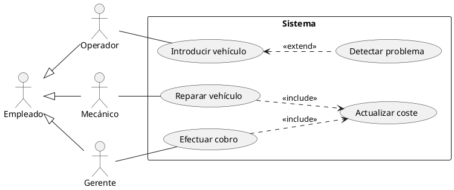

### Ejercicio 2. Tienda
En una tienda, un comerciante dispone de un sistema para gestionar su almacén. El sistema incluye las siguientes funciones:
* Gestión de archivo de proveedores.
* Posibilidad de agregar un nuevo artículo (en este caso, el archivo de proveedores se
actualiza automáticamente. Si el proveedor no existe, se puede crear).
* Gestión del inventario. Desde esta pantalla, se tiene la opción de imprimir el inventario, eliminar un artículo o editar el archivo de artículos).

**Solución propuesta:**
~~~
@startuml tienda
left to right direction

(Gestionar inventario) as (gesinv)
(Gestionar proveedores) as (gesprov)
(Editar archivo articulos) as (editart)
(Crear artículo) as (creart)

Comerciante -- (gesinv)
(gesinv) <.. (Imprimir inventario) : extend
(gesinv) <.. (Borrar artículo) : extend
(gesinv) <.. (editart) : extend

Comerciante -- (gesprov)
(gesprov) .> (editart) : extend

Comerciante -- (creart)
(creart) .> (gesprov) : include
(creart) <. (Crear proveedor) : extend
@enduml
~~~

**Vista previa:**
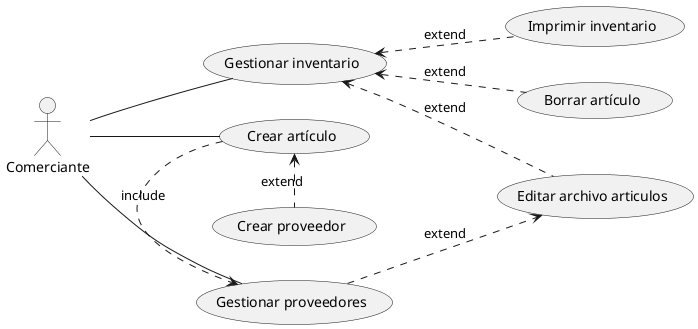

### Ejercicio 3. Gestión de proyectos
La única persona que controla los proyectos es el administrador de proyectos, cuyas funciones son las siguientes:
* Puede agregar, eliminar y actualizar un proyecto, pero para eliminar y actualizar es necesario encontrar el proyecto en cuestión.
* A la hora de actualizar un proyecto se pueden dar dos situaciones:
  * Cambiar la información sobre las tareas del proyecto.
  * Cambiar los recursos asociados al proyecto.
*  Para informar a todos los miembros del equipo sobre los avances en el proyecto se procede emitiendo un documento, que se envía vía e-mail o que se publica en un sitio web conocido por todos.
  
~~~
@startuml proyectos
left to right direction

actor "Administrador de proyectos" as admin
(Agregar proyecto) as (add)
(Eliminar proyecto) as (del)
(Actualizar proyecto) as (upd)
(Buscar proyecto) as (search)

admin -- (add)
admin -- (del)
admin -- (upd)

(del) ..> (search) : include
(upd) ..> (search) : include

(upd) <.. (Cambiar información tareas) : extend
(upd) <.. (Cambiar recursos asociados) : extend

admin -- (Informar miembros equipo)
(Informar miembros equipo) <.. (Enviar e-mail) : extend
(Informar miembros equipo) <.. (Publicar en sitio web) : extend

@enduml
~~~

**Vista previa:**
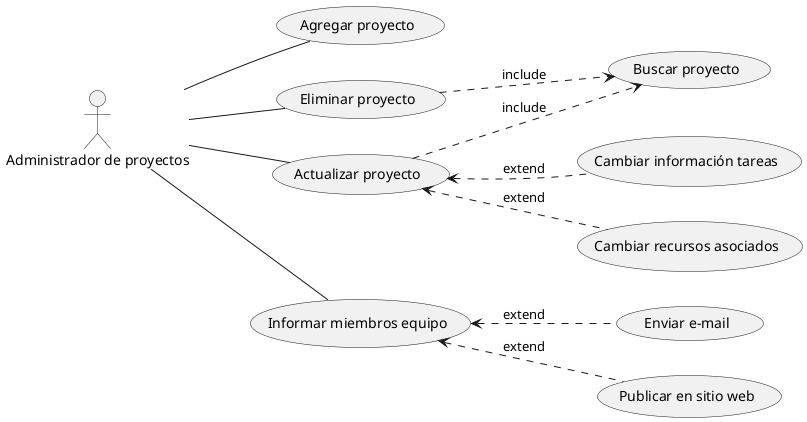

## Hoja 2. Diagramas de clases

### Ejercicio 1. Empresa
Una aplicación necesita tener información sobre empresas, empleados y clientes. Estos dos últimos se caracterizan por su nombre y edad.

Los empleados tienen un sueldo bruto y los que son directivos tienen una categoría y un conjunto de empleados subordinados.

De los clientes además se necesita saber su teléfono de contacto. 

La aplicación necesita mostrar los datos de empleados y clientes.

**Solución propuesta:**

~~~
@startuml empresa
'https://plantuml.com/class-diagram

skinparam classAttributeIconSize 0

Persona <|-- Empleado
Persona <|-- Cliente

Empleado <|-- Directivo
Empleado "0..*" -- "0..*" Directivo : subordinado

Empleado "1..*" --* "1" Empresa : empleados
Cliente "0..*" --o "1..*" Empresa : clientes

class Persona {
    - nombre : String
    - edad : int
    + mostrar()
}

class Empleado {
    - sueldoBruto : float
    + mostrar()
    + calcularSalarioNeto()
}

class Cliente {
    - telefono : String
    + mostrar()
}

class Directivo {
    - categoría : int
    + mostrar()
}

class Empresa {
    - nombre : String
}
@enduml
~~~

**Vista previa:**
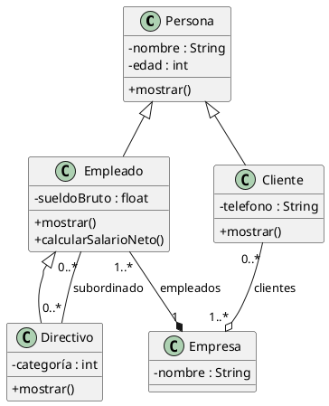

### Ejercicio 2. Biblioteca
Una aplicación necesita tener información sobre una biblioteca. Realiza el diagrama de clases y añade los métodos necesarios para realizar el préstamo y devolución de libros.

La biblioteca tiene copias de libros. Estos últimos se caracterizan por su nombre, tipo (novela, teatro, poesía, ensayo), editorial, año y autor.

Los autores se caracterizan por su nombre, nacionalidad y fecha de nacimiento.

Cada copia tiene un identificador, y puede estar en la biblioteca, prestada, con retraso o en reparación.

Los lectores pueden tener un máximo de 3 libros en préstamo.

Cada libro se presta un máximo de 30 días, por cada día de retraso se impone una multa de dos días sin posibilidad de coger un nuevo libro.

**Solución propuesta:**

~~~
@startuml biblioteca
'https://plantuml.com/class-diagram

skinparam classAttributeIconSize 0

enum Genero << enumeration >> {
    novela
    teatro
    poesía
    ensayo
}

enum Estado << enumeration >> {
    prestado
    retraso
    biblioteca
    reparación
}

class Copia {
    - referencia : Integer
    - estado: EstadoCopia
}
class Socio {
    - numero : Integer
    - nombre : String
    - direccion : String
    - telefono : String
}
class Préstamo {
    - inicio : Date
    - fin : Date
}

class Libro {
    - titulo : String
    - editorial : String
    - year : Integer
    - tipo : Genero
}

class Autor {
    - nombre : String
    - nacionalidad : String
    - fechaNacimiento : Date
}

Copia "0..3" -- "0..1" Socio
(Copia, Socio) .. Préstamo
Socio "sancionado" --- "sanción \n 0..1" Multa : recibe

Copia "ejemplar \n 1..*" --right-- "libro" Libro
Libro "obra \n 1..*" --down- "autor" Autor

@enduml
~~~

**Vista previa:**
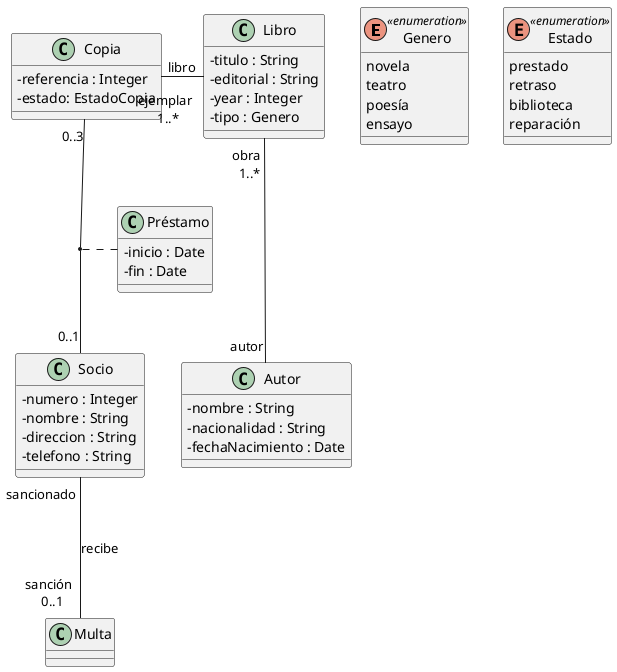

### Ejercicio 3. Viajes
Especificar un diagrama de clases que describa los vuelos que oferta una compañía de viajes según la siguiente especificación:
* La compañía oferta una serie de vuelos para unas fechas concretas y con un número de plazas.
* La compañía dispone de una flota de aviones con una capacidad que da soporte a los vuelos ofertados.
* Las personas compran billetes para los vuelos que le interesan. Para emitir el billete es necesario conocer el nombre, apellidos y edad del pasajero.
* Los billetes identifican el número de asiento que ocupan.
  
~~~
@startuml viajes
'https://plantuml.com/class-diagram

skinparam classAttributeIconSize 0

enum Genero << enumeration >> {
    hombre
    mujer
}

class Vuelo {
    - plazas : Integer
    - fecha: Date
}
class Persona {
    - nombre : String
    - apellidos : String
    - fechaNacimiento : Date
    - sexo : Genero
}
class Billete {
    - asiento : Integer
}

class Avión {
    - modelo : String
    - capacidad : Integer
}

Vuelo "0..*" -- "pasajero \n 0..*" Persona : viaja
(Vuelo, Persona) .. Billete
Vuelo "0..*" --- "1" Avión : es realizado

@enduml
~~~

**Vista previa:**
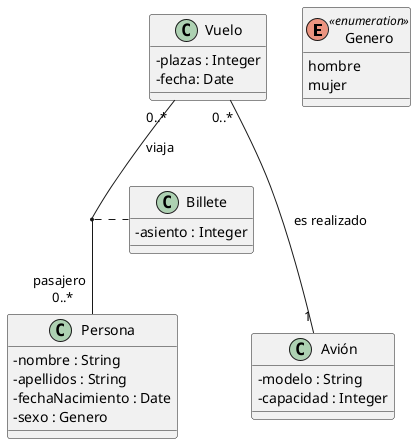

### Ejercicio 4. Proyectos
Especificar un diagrama de clases que describa la gestión de proyectos informáticos siguiendo el proceso unificado:
* Un proyecto requiere de una serie de ciclos de desarrollo.
* Todo ciclo de desarrollo concluye con una versión ejecutable y son necesarias cuatro fases
para completarlo: inicio, elaboración, construcción y transición.
* A su vez las fases requieren varias iteraciones.
* Las iteraciones son una secuencia de actividades, las cuales tienen una duración y necesitan unos recursos (materiales y humanos).
* Las iteraciones pueden producir artefactos de muy distinto tipo (documentación, resultados de pruebas, software).
* Es importante medir el estado de avance del proyecto.

~~~
@startuml proyectos
'https://plantuml.com/class-diagram

skinparam classAttributeIconSize 0

Proyecto o-- "1..* \n {ordered}" Ciclo
Ciclo -down- Ejecutable

Ciclo o-right- "4 \n {ordered}" Fase
Fase  o-right- "1..* \n {ordered}" Iteración

Iteración -down- "1..*" Artefacto : produce
Artefacto <|-- Documento
Artefacto <|-- Software

Iteración o-right- "1..*" Actividad
Actividad "0..*" o-down- "0..*" Recurso
Recurso <|-- Humano
Recurso <|-- Material

class Proyecto {
    - nombre : String
    - avance : Float
}

class Ejecutable {
    - bytes
}

class Fase {
    - tipo : TipoFase
}

enum TipoFase << enumeration >> {
    inicio
    elaboración
    construcción
    transición
}

class Iteración {
    - comienzo : Date
}

class Artefacto {}

class Documento {
    - nombre : String
    - ubicación : String
}

class Software {
    - bytes : Integer
}

class Actividad {
    - duración : Integer
    - avance : Float
}

class Recurso {}

class Humano {
    - nombre : String 
}

class Material {
    - inventario : String
}
@enduml
~~~

**Vista previa:**
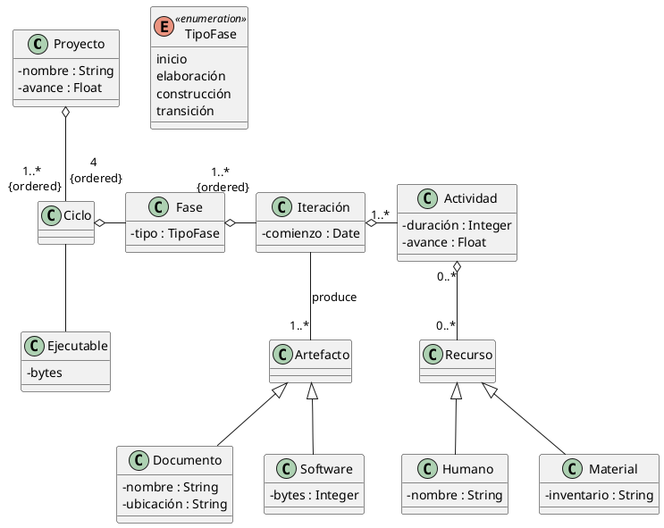

### Ejercicio 5. Instalaciones deportivas
Un centro de instalaciones deportivas quiere hacer una aplicación de reservas. En el centro existen instalaciones deportivas (piscinas, frontones, gimnasios y pistas de tesis). El centro en cuestión tiene socios, de los cuales se almacenan su nombre, dirección, ciudad, provincia, teléfono y cuota. Además, existen una serie de artículos que se pueden reservar si el socio lo requiere (balones, redes y raquetas). Cada instalación es reservada por un socio en una fecha dada desde una hora de inicio hasta una hora de fin. Cada reserva puede tener asociada uno o varios artículos deportivos que se alquilan a parte. Por ejemplo, si yo quiero hacer una reserva para jugar al tenis, tengo que reservar una instalación polideportiva y si lo necesito, las raquetas.

~~~
@startuml instdepor
'https://plantuml.com/class-diagram

skinparam classAttributeIconSize 0

enum TipoInstalacion << enumeration >> {
    Piscina
    Frontón
    Gimnasio
    PistaTenis
}

enum TipoArticulo << enumeration >> {
    Balón
    Red
    Raqueta
}

class Socio {
    - nombre : String
    - direccion : String
    - ciudad : String
    - provincia : String
    - telefono : String
    - cuota : Float
}

class Articulo {
    - codigo : Integer
    - descripcion : String 
    - tipo : TipoArticulo
}

class Instalacion {
    - nombre : String
    - tipo : TipoInstalacion
}

class Reserva {
    - id : Integer
    - fecha : Date
    - horaInicio : Date
    - horaFin : Date
}

class ReservaArticulo {
    - cantidad : Integer
}

class ReservaInstalacion {
}

Socio "1" -- "0..*" Reserva

Articulo "1" -up- "0..*" ReservaArticulo 
Instalacion "1" -up- "0..*" ReservaInstalacion 

Reserva <|-- ReservaArticulo
Reserva <|- ReservaInstalacion

@enduml
~~~

**Vista previa:**
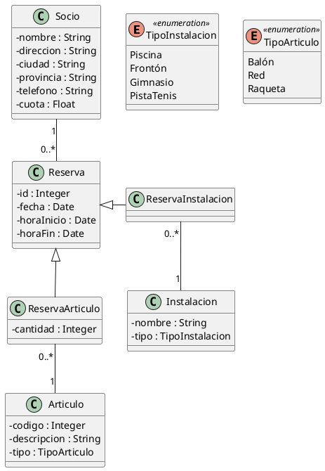

### Ejercicio 6. Sistema operativo
Hacer el Diagrama de Clases que modele el siguiente sistema: Un directorio puede contener muchos otros directorios y puede estar contenido opcionalmente dentro de otro directorio. Todo directorio posee exactamente un usuario que sea su propietario y hay muchos usuarios que están autorizados para utilizar el directorio.

~~~
@startuml ssoo
'https://plantuml.com/class-diagram

'left to right direction
skinparam classAttributeIconSize 0

Directorio "padre \n 0..1" *-- "1..*  \n hijos" Directorio

Usuario "1" --- "0..*" Directorio : "propietario" <
Directorio "0..*" -- "1..*" Usuario : "autorizados" >

class Directorio {
    - nombre : String
}

class Usuario {
    - nombre : String
}
@enduml
~~~

**Vista previa:**
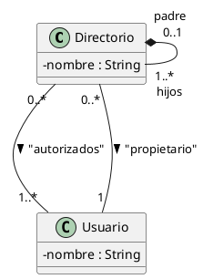

### Ejercicio 7. Compañía de seguridad
Una compañía de seguridad tiene una serie de centrales de alarma distribuidas por zonas dentro de una ciudad. Cada central de alarma está conectada con una serie de edificios. Dentro de cada edificio se dispone de dos tipos de alarmas: alarma de incendios y alarma de robo. Cada alarma está conectada con una serie de sensores (de robo y de fuego). Cuando se activa un sensor de fuego, la alarma correspondiente suena y la compañía de seguridad avisa a los bomberos y a la policía, mientras que si se activa un sensor de robo se avisa únicamente a la policía.

~~~
@startuml seguridad
'https://plantuml.com/class-diagram

'left to right direction
skinparam classAttributeIconSize 0

Central "1" -- "1..*" Edificio
Edificio "1" - "1..*" Alarma : "tiene conectadas" >
Edificio "1" - "1..*" Sensor : "tiene instalados" >
Alarma "1" -- "1..*" Sensor : "vinculados a" <
Alarma <|.. AlarmaFuego
Alarma <|.. AlarmaRobo
AlarmaFuego "1..*" -- "1" Edificio : "conectada a" >
AlarmaRobo "1..*" -- "1" Edificio : "conectada a" >

class Central {
    - nombre : String
}

class Edificio {
    - nombre : String
    - direccion : String
}

class Sensor {
    - estado : Boolean
    - tipo : TipoSensor
    + activado() : Boolean 
    + activar(tipo : TipoSensor) : void
}
enum TipoSensor {
    FUEGO
    ROBO
}

interface Alarma {
    + sonar() : void 
    + avisar() : void
}

class AlarmaFuego {
}

class AlarmaRobo {
}
@enduml
~~~

**Vista previa:**
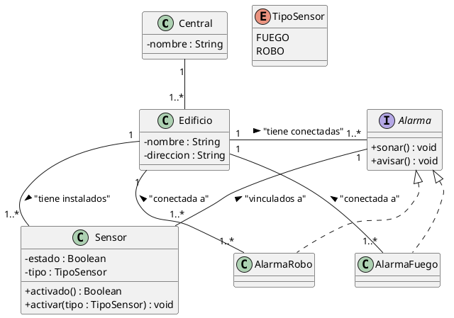

### Ejercicio 8. Universidad
Se trata de modelizar un sistema que gestiona las matriculas de los estudiantes en una universidad. Una persona viene caracterizada por su dni, nombre, dirección y estado civil, y ésta puede convertirse en estudiante al darse de alta como tal en la universidad. Como estudiante podrá matricularse de las asignaturas que se imparten en la universidad, que tendrán un código, un nombre, un profesor responsable y un curso asignado. Una vez matriculado, el estudiante podrá recibir una beca, y en su nueva condición de becario tendrá asignado un nuevo código y se conocerá el importe de la misma; al finalizar el curso, la condición de becario acabará. Una vez el estudiante se matricula, tanto si recibe beca como si no, deberá examinarse de las asignaturas en las que se encuentra matriculado hasta que finalice el curso y vuelva a matricularse de nuevo, o bien deje la universidad y con ello deje de ser estudiante. Además, convendrá tener una serie de aplicaciones tales como dar de alta a nuevas personas y asignaturas, llevar a cabo la matriculación de estudiantes en asignaturas, registrar las notas obtenidas por los estudiantes al examinarse de cualquier asignatura en la que están matriculados y una serie de listados tales como los alumnos matriculados en una asignatura, las asignaturas en las que se ha matriculado un alumno y el listado de notas por asignatura (actas).

~~~
@startuml universidad
'https://plantuml.com/class-diagram

'left to right direction
skinparam classAttributeIconSize 0

Persona <|-- Estudiante
Persona <|-- Profesor
Estudiante "1" -up- "1" Beca
Profesor "1" -- "1..*" Asignatura
Estudiante "1..*" -- "1..*" Asignatura
(Estudiante, Asignatura) .. Matricula
Curso "1..*" -- "1..*" Asignatura

class Persona {
    - dni : String
    - nombre : String
    - direccion : String
    - estadoCivil : String
}

class Estudiante {
    - codigo : Integer
    + listarAsignaturas() : void
}

class Asignatura {
    - codigo : Integer
    - nombre : String
    + listarAlumnos() : void
}

class Curso {
    - nombre : String
}

class Beca {
    - codigo : Integer
    - importe : Float
}

class Matricula {
    - calificacion : Float
    + listarNotas() : void
}

class Profesor {
}

@enduml
~~~

**Vista previa:**
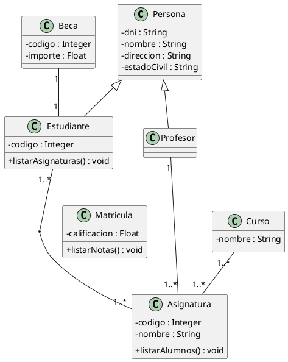