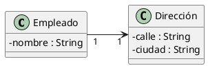
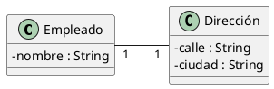
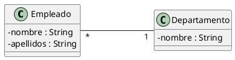
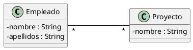
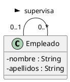
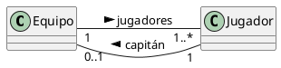
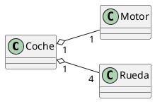
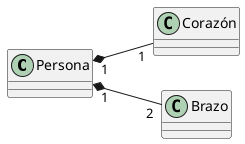
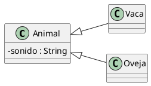

# De diagrama de clases UML a clases Java

## Asociaciones "Uno a Uno" (0..1 ó 1)
### Direccional



```java
public class Empleado {
    private String nombre;
    private Dirección dirección;
}

public class Dirección {
    private String calle;
    private String ciudad;
}
```

### Bidireccional



```java
public class Empleado {
    private String nombre;
    private Dirección dirección;
}

public class Dirección {
    private String calle;
    private String ciudad;
    private Empleado empleado;
}
```


## Asociaciones con multiplicidad *
### Bidireccional "Uno a Muchos" ó "Muchos a Uno"



```java
public class Empleado {
    private String nombre;
    private String apellidos;
    private Departamento departamento;
}

public class Departamento {
    private String nombre;
    private List<Empleado> empleados;
}
```

### Bidireccional "Muchos a Muchos"



```java
public class Empleado {
    private String nombre;
    private String apellidos;
    private List<Proyecto> proyectos;
}

public class Proyecto {
    private String nombre;
    private List<Empleado> empleados;
}
```

### Recursiva



```java
public class Empleado {
    private String nombre;
    private String apellidos;
    private Empleado responsable;
    private List<Empleado> subordinados;
}
```

## Asociaciones múltiples



```java
public class Equipo {
    private List<Jugador> jugadores;
    private Jugador capitán;
}

public class Jugador {
    private Equipo juega;
    private Equipo capitanea; 
}
```

## Agregación



```java
public class Motor {
}

public class Rueda {
}

public class Coche {
    private Motor motor;
    private List<Rueda> ruedas;

    public Coche (Motor motor, List<Rueda> ruedas) {
        this.motor = motor;
        this.ruedas = ruedas;
    }
}
```

## Composición



```java
public class Corazón {
}

public class Brazo {
}

public class Persona {
    private final Corazón corazón;
    private final List<Brazo> brazos;

    public Persona () {
        this.corazón = new Corazón();
        this.brazos = new ArrayList<Brazo>();
    }
}
```

## Herencia


```java
public class Animal {
    String sonido;
    public Animal (String sonido) {
        this.sonido = sonido;
    }
}

public class Vaca extends Animal {
    public Vaca() {
        this.sonido = "muu";
    }
}

public class Oveja extends Animal {
    public Oveja() {
        super("bee");
    }
}
```